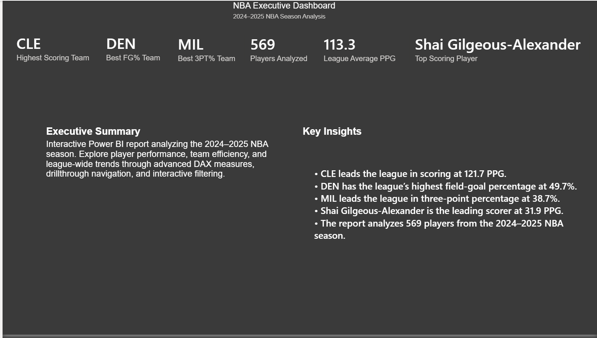
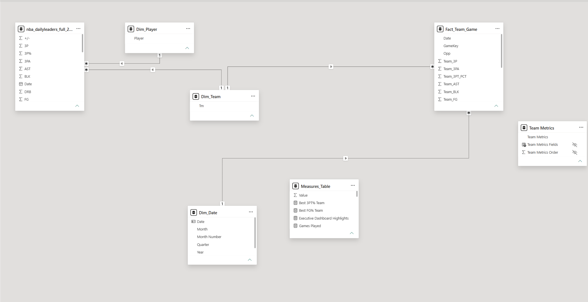
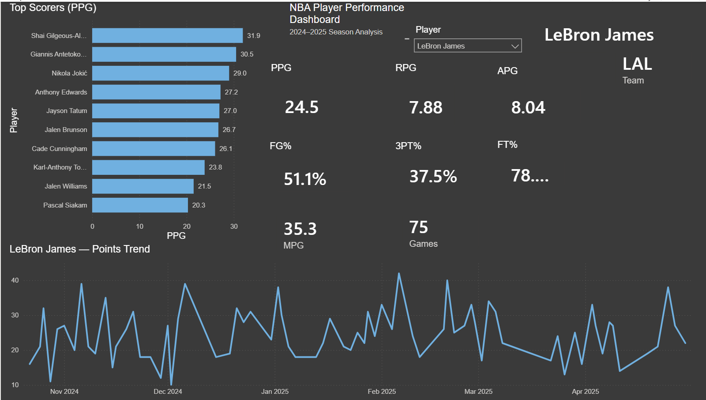
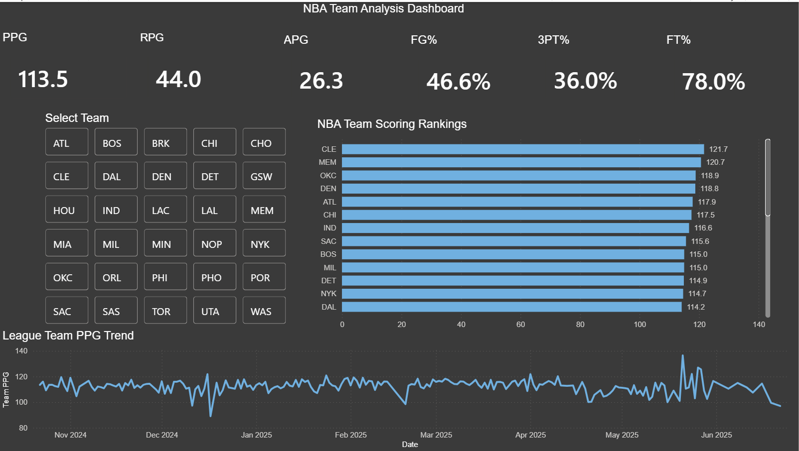
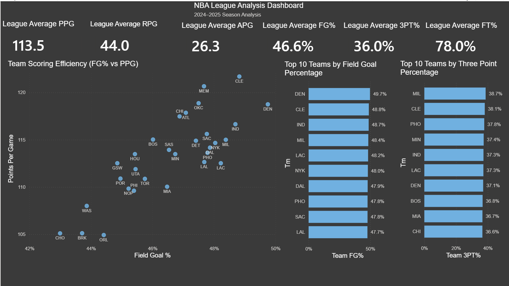

# 🏀 NBA Power BI Analytics Dashboard


An interactive Power BI dashboard analyzing the **2024–2025 NBA season** using business intelligence best practices.

This project demonstrates the complete BI workflow from raw data transformation to executive reporting using Power BI.


## Table of Contents

- Project Overview
- Dashboard Preview
- Data Model
- DAX Showcase
- ETL Workflow
- Solution Architecture
- Technologies
- Business Questions
- Skills Demonstrated
---

# Dashboard Preview

## Executive Dashboard



The Executive Dashboard provides a high-level overview of league performance, highlighting the highest-scoring team, best shooting teams, league averages, player totals, and executive insights.

---

## Data Model

The dashboard is built using a dimensional star schema to support scalable reporting and efficient DAX calculations.

## DAX Showcase

The dashboard uses custom DAX measures to calculate advanced basketball analytics while avoiding duplicate aggregation and ensuring accurate business reporting.

## Data Preparation and ETL

The dashboard uses Power Query to transform raw NBA data into a structured and analysis-ready model.

### Transformation Process

- Imported raw NBA player and game-level statistics.
- Standardized data types for dates, numeric fields, and percentages.
- Cleaned inconsistent and duplicate records.
- Created reusable dimension tables for players, teams, and dates.
- Built `Fact_Team_Game` to support accurate team-level analysis.
- Aggregated player-level records into team-game totals where required.
- Created unique game identifiers to support distinct game counts.
- Prepared the model for a star-schema reporting structure.
- Loaded only the fields required for reporting and analysis.

### Why This Matters

The ETL process ensures that calculations are performed at the correct level of detail, reduces duplicate aggregation, and improves consistency across player, team, and league-level reporting.

## Solution Architecture

```text
Raw NBA Data
      │
      ▼
Power Query Transformations
      │
      ▼
Dimensional Data Model
      │
      ▼
Reusable DAX Measures
      │
      ▼
Interactive Power BI Report

### Highest Scoring Team

```DAX
Highest Scoring Team = 
VAR TeamTable =
    TOPN(
        1,
        ALL(Dim_Team[Tm]),
        [Team PPG],
        DESC
    )
RETURN
    MAXX(TeamTable, Dim_Team[Tm])
```

**Purpose**

Identifies the highest-scoring team in the league by ranking all teams using the `Team PPG` measure.

**DAX concepts demonstrated**

- `TOPN` for ranking
- `ALL` to remove the current team filter
- `MAXX` to return the team abbreviation from the virtual table
- Variables for clearer and more maintainable logic

---

### Top Scoring Player

```DAX
Top Scoring Player = 
VAR TopPlayer =
    TOPN(
        1,
        ALL(Dim_Player[Player]),
        [PPG],
        DESC
    )
RETURN
    MAXX(TopPlayer, Dim_Player[Player])
```

**Purpose**

Returns the league’s leading scorer by evaluating every player against the `PPG` measure.

**DAX concepts demonstrated**

- Dynamic player ranking
- Filter-context removal with `ALL`
- Virtual tables created with `TOPN`
- Iterator logic using `MAXX`

---

### Dynamic Executive Dashboard Highlights

```DAX
Executive Dashboard Highlights = 
VAR TopScoringTeam =
    [Highest Scoring Team]

VAR TopTeamPPG =
    MAXX(
        TOPN(
            1,
            ALL(Dim_Team[Tm]),
            [Team PPG],
            DESC
        ),
        [Team PPG]
    )

VAR BestFGTeam =
    [Best FG% Team]

VAR BestFGValue =
    MAXX(
        TOPN(
            1,
            ALL(Dim_Team[Tm]),
            [Team FG%],
            DESC
        ),
        [Team FG%]
    )

VAR Best3PTTeam =
    [Best 3PT% Team]

VAR Best3PTValue =
    MAXX(
        TOPN(
            1,
            ALL(Dim_Team[Tm]),
            [Team 3PT%],
            DESC
        ),
        [Team 3PT%]
    )

VAR TopPlayer =
    [Top Scoring Player]

VAR TopPlayerPPG =
    MAXX(
        TOPN(
            1,
            ALL(Dim_Player[Player]),
            [PPG],
            DESC
        ),
        [PPG]
    )

VAR PlayerCount =
    [Total Players]

RETURN
    "• " & TopScoringTeam
        & " leads the league in scoring at "
        & FORMAT(TopTeamPPG, "0.0")
        & " PPG."
        & UNICHAR(10)
        & "• " & BestFGTeam
        & " has the league’s highest field-goal percentage at "
        & FORMAT(BestFGValue, "0.0%")
        & "."
        & UNICHAR(10)
        & "• " & Best3PTTeam
        & " leads the league in three-point percentage at "
        & FORMAT(Best3PTValue, "0.0%")
        & "."
        & UNICHAR(10)
        & "• " & TopPlayer
        & " is the leading scorer at "
        & FORMAT(TopPlayerPPG, "0.0")
        & " PPG."
        & UNICHAR(10)
        & "• The report analyzes "
        & FORMAT(PlayerCount, "#,0")
        & " players from the 2024–2025 NBA season."
```

**Purpose**

Generates a dynamic executive summary that automatically updates league leaders, efficiency metrics, scoring statistics, and player counts based on the current data model.

**DAX concepts demonstrated**

- Reusable measures
- Variables for modular business logic
- Virtual tables with `TOPN`
- Iterators using `MAXX`
- Filter-context control with `ALL`
- Dynamic text concatenation
- Numeric and percentage formatting with `FORMAT`
- Multi-line narrative output using `UNICHAR(10)`

This measure turns analytical results into executive-ready commentary rather than displaying isolated KPIs only.

### Team Points Per Game

```DAX
Team PPG =
AVERAGEX(
    SUMMARIZE(
        Fact_Team_Game,
        Fact_Team_Game[Tm],
        Fact_Team_Game[Date],
        "GamePts", SUM(Fact_Team_Game[Team_PTS])
    ),
    [GamePts]
)
```

**Purpose**

Calculates each team's average points per game by first aggregating points at the game level and then averaging those totals. This approach prevents duplicate aggregation and produces accurate team-level statistics.

---

### Games Played

```DAX
Games Played =
DISTINCTCOUNT(Fact_Team_Game[GameKey])
```

**Purpose**

Calculates the number of unique games played for the selected player or team using a distinct game identifier.

---

### Dynamic Executive Dashboard Insight

```DAX
Executive Dashboard Highlights
```

**Purpose**

Generates dynamic narrative insights for the Executive Dashboard using DAX variables and text functions, automatically updating key business insights based on report calculations.

### Model Components

- **Fact_Team_Game** – Stores team-level game statistics.
- **Dim_Player** – Player dimension used for player-level analysis.
- **Dim_Team** – Team dimension used throughout the report.
- **Dim_Date** – Calendar dimension enabling time-series analysis.
- **Measures_Table** – Centralized repository for reusable DAX measures.
- **Team Metrics** – Supporting table used for metric selection and report flexibility.

This model separates facts from dimensions, improving report performance, simplifying relationships, and following Business Intelligence best practices.




## Player Analysis



Analyze individual player performance through interactive filtering, KPIs, and game-by-game scoring trends.

Features include:

- Points Per Game
- Rebounds Per Game
- Assists Per Game
- Shooting Percentages
- Minutes Per Game
- Games Played
- Dynamic scoring trend

---

## Team Analysis



Compare every NBA team using interactive team selection, league rankings, and historical scoring trends.

---

## League Analysis



Explore league-wide relationships using scatter plots, custom report page tooltips, and efficiency rankings.

---

# Project Overview

The objective of this project was to build a complete Business Intelligence solution capable of transforming raw NBA game data into actionable insights for coaches, analysts, and executives.

The report emphasizes clean design, intuitive navigation, interactive exploration, and executive-level reporting.

---

# Skills Demonstrated

- Microsoft Power BI
- DAX
- Power Query
- Star Schema Data Modeling
- KPI Design
- Interactive Dashboards
- Report Page Tooltips
- Data Visualization
- Business Intelligence Reporting
- Sports Analytics

---

# Technologies

- Microsoft Power BI
- Power Query
- DAX
- NBA 2024–2025 Season Dataset

---

# Business Questions Answered

- Which team has the highest scoring offense?
- Which teams shoot most efficiently?
- Who are the league's top scorers?
- How does shooting efficiency relate to offensive production?
- How has player scoring changed throughout the season?
- How do teams compare across key offensive metrics?

---

# Project Highlights

✅ Executive Dashboard

✅ Interactive Player Analytics

✅ Team Performance Dashboard

✅ League Analysis Dashboard

✅ Dynamic DAX Measures

✅ Custom Report Page Tooltips

✅ Interactive Filtering

✅ Business-Oriented Visual Design

---

# Future Improvements

- Predictive player performance modeling
- Team comparison dashboard
- Win probability analytics
- Advanced player similarity analysis
- Automated data refresh pipeline

---

# Author

**Diego Castillo**

B.S. Computer Science

M.S. Sports Management

Business Intelligence • Data Analytics • Sports Analytics
